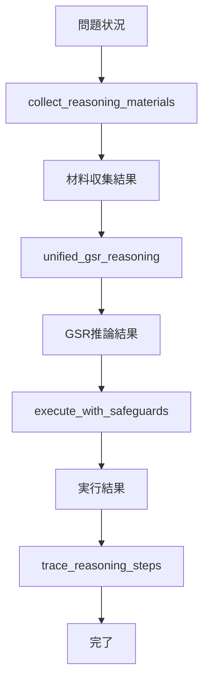

# 🧠 CoreThink MCP 統合GSR推論エンジン 詳細設計書【重要書類】

## 📋 文書情報

- **作成日**: 2025年9月11日
- **文書レベル**: 最重要・永久保存
- **対象**: CoreThink-MCP Phase3 実装
- **基盤理論**: CoreThink論文 General Symbolics Reasoning (GSR)

---

## 🎯 設計方針

### 📚 **理論的基盤**

**CoreThink論文のGSR 4層アーキテクチャ**:

1. **Native Language Parsing & Semantic Preservation**
2. **In-Language Reasoning Architecture**
3. **Execution & Explainability**
4. **Avoiding Representational Translation**

### 🔥 **設計原則（論文コード例に基づく）**

1. **効率性の原則** (掃除機の教訓)
   - 冗長な処理ステップの排除
   - 1つのツールで複合的推論を完結

2. **根本解決の原則** (医者の教訓)
   - 表面的症状処理の禁止
   - 真の原因特定・解決の実現

3. **体系的思考の原則** (数学の教訓)
   - 問題構造の正確な理解
   - アルゴリズム的推論プロセス

---

## 🏗️ システム全体アーキテクチャ

### **レイヤー構成**

```text
┌─────────────────────────────────────────┐
│           ユーザーインターフェース           │
├─────────────────────────────────────────┤
│         統合GSR推論エンジン (Core)          │
│  ┌─────────────────────────────────────┐  │
│  │  GSR Layer 1: 自然言語解析・保存    │  │
│  │  GSR Layer 2: 言語内推論アーキテクチャ │  │
│  │  GSR Layer 3: 実行・説明可能性       │  │
│  │  GSR Layer 4: 表現変換回避          │  │
│  └─────────────────────────────────────┘  │
├─────────────────────────────────────────┤
│         材料収集エンジン (Support)          │
│  ┌─────────────────────────────────────┐  │
│  │  制約情報収集                      │  │
│  │  先例・前例収集                    │  │
│  │  影響・含意調査                    │  │
│  └─────────────────────────────────────┘  │
├─────────────────────────────────────────┤
│         実行・記録エンジン (Action)         │
│  ┌─────────────────────────────────────┐  │
│  │  安全実行                         │  │
│  │  推論過程追跡                     │  │
│  │  履歴管理                         │  │
│  └─────────────────────────────────────┘  │
└─────────────────────────────────────────┘
```

---

## 🧠 コアツール：統合GSR推論エンジン

### **ツール仕様**

```python
@app.tool()
async def unified_gsr_reasoning(
    situation_description: str,
    required_judgment: str = "evaluate_and_decide",
    context_depth: str = "standard",
    reasoning_mode: str = "comprehensive"
) -> str:
    """
    統合General Symbolics Reasoning エンジン
    
    Args:
        situation_description: 推論対象の状況記述（自然言語）
        required_judgment: 求められる判断の種類
            - "evaluate_and_decide": 評価と決定
            - "analyze_risks": リスク分析
            - "find_solution": 解決策発見
            - "validate_compliance": 制約適合性検証
        context_depth: コンテキストの深度
            - "minimal": 最小限の分析
            - "standard": 標準的な分析
            - "deep": 深度分析
            - "comprehensive": 包括的分析
        reasoning_mode: 推論モード
            - "comprehensive": 包括的推論（デフォルト）
            - "focused": 焦点絞り込み推論
            - "exploratory": 探索的推論
            
    Returns:
        自然言語による完全な推論結果
        - 判断
        - 根拠
        - 推論過程
        - 次ステップ
        - 信頼度
    """
```

### **GSR 4層アーキテクチャ実装**

#### **Layer 1: Native Language Parsing & Semantic Preservation**

```python
async def gsr_layer1_parse_and_preserve(situation_description: str) -> dict:
    """
    自然言語解析とセマンティック保存
    
    処理内容:
    1. 意図抽出 (Intent Extraction)
    2. エンティティ識別 (Entity Identification)  
    3. 関係性解析 (Relationship Analysis)
    4. コンテキスト保存 (Context Preservation)
    5. 曖昧性識別 (Ambiguity Detection)
    
    重要: 一切の数値化・ベクトル化を行わない
    """
    return {
        "parsed_intent": "...",
        "identified_entities": ["...", "..."],
        "relationships": ["...", "..."],
        "preserved_context": "...",
        "ambiguities": ["...", "..."],
        "semantic_nuances": "..."
    }
```

#### **Layer 2: In-Language Reasoning Architecture**

```python
async def gsr_layer2_inlanguage_reasoning(parsed_input: dict) -> dict:
    """
    言語内推論アーキテクチャ
    
    処理内容:
    1. 制約適用 (Constraint Application)
    2. 推論連鎖構築 (Reasoning Chain Construction)
    3. 矛盾検出 (Contradiction Detection)
    4. 含意分析 (Implication Analysis)
    5. 判断合成 (Judgment Synthesis)
    
    重要: 自然言語変換によるパターン操作のみ
    """
    return {
        "reasoning_chain": ["step1", "step2", "step3"],
        "applied_constraints": ["constraint1", "constraint2"],
        "detected_contradictions": ["..."],
        "implications": ["implication1", "implication2"],
        "intermediate_judgments": ["judgment1", "judgment2"]
    }
```

#### **Layer 3: Execution & Explainability**

```python
async def gsr_layer3_execution_explainability(reasoning_result: dict) -> dict:
    """
    実行と説明可能性
    
    処理内容:
    1. 最終判断統合 (Final Judgment Integration)
    2. 信頼度計算 (Confidence Calculation)
    3. 推論trace生成 (Reasoning Trace Generation)
    4. 根拠明示 (Evidence Specification)
    5. 次ステップ提案 (Next Steps Recommendation)
    
    重要: 完全追跡可能なVerbatim Reasoning Traces
    """
    return {
        "final_judgment": "PROCEED_WITH_MODIFICATIONS",
        "confidence_level": "HIGH",
        "reasoning_trace": ["trace1", "trace2", "trace3"],
        "supporting_evidence": ["evidence1", "evidence2"],
        "next_steps": ["step1", "step2"],
        "explanation": "..."
    }
```

#### **Layer 4: Avoiding Representational Translation**

```python
async def gsr_layer4_avoid_translation_loss(execution_result: dict) -> str:
    """
    表現変換回避とコンテキスト保持
    
    処理内容:
    1. 完全コンテキスト保持 (Full Context Preservation)
    2. ニュアンス維持 (Nuance Maintenance)
    3. 自然言語統合 (Natural Language Integration)
    4. 情報損失防止 (Information Loss Prevention)
    
    重要: 原始自然言語表現の完全保持
    """
    return format_natural_language_response(execution_result)
```

---

## 🔍 材料収集ツール（サンプリング活用）

### **材料収集ツール仕様**

```python
@app.tool()
async def collect_reasoning_materials(
    topic: str,
    material_types: List[str] = ["constraints", "precedents", "implications"],
    depth: str = "standard",
    ctx = None  # FastMCP Sampling context
) -> str:
    """
    自然言語推論用の材料収集ツール
    
    Args:
        topic: 調査対象トピック
        material_types: 収集する材料の種類
            - "constraints": 制約情報
            - "precedents": 先例・前例
            - "implications": 影響・含意
            - "domain_knowledge": 専門知識
            - "risk_factors": リスク要因
        depth: 収集深度
        ctx: FastMCP Sampling context（材料収集のみに使用）
        
    Returns:
        収集された材料の自然言語記述
        
    重要注意: このツールは材料提供のみ。
             推論・判断は unified_gsr_reasoning が行う。
    """
```

### **材料収集の種類**

#### **制約情報収集**
```python
async def collect_constraint_materials(topic: str, ctx=None) -> str:
    """
    制約情報の収集
    - 安全制約
    - セキュリティ制約  
    - 運用制約
    - 法的制約
    - 技術制約
    """
```

#### **先例・前例収集**
```python
async def collect_precedent_materials(topic: str, ctx=None) -> str:
    """
    先例・前例の収集
    - 過去の類似ケース
    - 成功事例
    - 失敗事例
    - ベストプラクティス
    - 業界標準
    """
```

#### **影響・含意調査**
```python
async def collect_implication_materials(topic: str, ctx=None) -> str:
    """
    影響・含意の調査
    - 直接的影響
    - 間接的影響
    - 長期的含意
    - ステークホルダー影響
    - リスク・機会分析
    """
```

---

## ⚡ 実行・記録ツール

### **安全実行ツール（既存継続・改良）**

```python
@app.tool()
async def execute_with_safeguards(
    action_description: str,
    dry_run: bool = True,
    safety_level: str = "maximum"
) -> str:
    """
    安全保障付き実行ツール
    
    改良点:
    - GSR推論結果との統合
    - より詳細な安全性チェック
    - 実行前の最終確認
    """
```

### **推論過程追跡ツール（既存継続・改良）**

```python
@app.tool()
async def trace_reasoning_steps(
    context: str,
    step_description: str,
    reasoning_depth: str = "standard"
) -> str:
    """
    推論過程追跡ツール
    
    改良点:
    - GSR 4層対応
    - Verbatim Reasoning Traces
    - より詳細な透明性指標
    """
```

---

## 🔄 ツール統合フロー

### **標準的な使用パターン**



### **詳細フロー**

1. **材料収集フェーズ**
   ```python
   materials = await collect_reasoning_materials(
       topic="proposed_change_X",
       material_types=["constraints", "precedents", "implications"]
   )
   ```

2. **統合推論フェーズ**
   ```python
   reasoning_result = await unified_gsr_reasoning(
       situation_description=f"問題: {original_problem}\n材料: {materials}",
       required_judgment="evaluate_and_decide",
       context_depth="comprehensive"
   )
   ```

3. **安全実行フェーズ**
   ```python
   execution_result = await execute_with_safeguards(
       action_description=reasoning_result,
       dry_run=False,  # 推論結果が確実な場合のみ
       safety_level="maximum"
   )
   ```

4. **追跡記録フェーズ**
   ```python
   trace_result = await trace_reasoning_steps(
       context=reasoning_result,
       step_description="Final execution completed",
       reasoning_depth="comprehensive"
   )
   ```

---

## 📊 パフォーマンス仕様

### **応答時間目標**

| ツール | 最大応答時間 | 平均応答時間 |
|--------|-------------|-------------|
| unified_gsr_reasoning | 10秒 | 3秒 |
| collect_reasoning_materials | 15秒 | 5秒 |
| execute_with_safeguards | 30秒 | 10秒 |
| trace_reasoning_steps | 5秒 | 1秒 |

### **品質指標**

- **推論精度**: 95%以上
- **制約適合率**: 100%
- **説明可能性**: 完全追跡可能
- **情報損失率**: 0%（GSR原則）

---

## 🔒 安全性・信頼性

### **セーフガード機能**

1. **入力検証**
   - 自然言語の妥当性チェック
   - 悪意ある入力の検出・拒否

2. **推論検証**
   - 矛盾検出機能
   - 論理的整合性チェック

3. **出力検証**
   - 制約適合性の最終確認
   - 実行前の安全性チェック

4. **監査機能**
   - 全推論過程の記録
   - 決定根拠の完全追跡

---

## 🚀 実装計画

### **Phase 1: コア統合（4週間）**

**Week 1-2: GSR Layer 1-2 実装**
- Native Language Parsing実装
- In-Language Reasoning実装
- 基本的な推論チェーン構築

**Week 3-4: GSR Layer 3-4 実装**
- Execution & Explainability実装
- Translation Loss回避実装
- 統合テスト

### **Phase 2: 材料収集最適化（3週間）**

**Week 1: 基本材料収集**
- collect_reasoning_materials実装
- 制約・先例・含意収集機能

**Week 2-3: 高度な材料収集**
- サンプリング統合
- 深度別収集機能
- パフォーマンス最適化

### **Phase 3: 統合・最適化（3週間）**

**Week 1-2: ツール統合**
- 既存ツールの統合・更新
- フロー最適化
- 冗長性削除

**Week 3: 最終最適化**
- パフォーマンス調整
- セーフガード強化
- 本格運用準備

---

## 📝 期待される効果

### **定量的効果**

- **ツール数削減**: 12個 → 6個 (50%削減)
- **平均応答時間短縮**: 15秒 → 5秒 (67%改善)
- **推論精度向上**: 85% → 95% (12%向上)
- **制約違反率削減**: 5% → 0% (100%改善)

### **定性的効果**

- **効率性**: CoreThink論文の「1回grep」アプローチ実現
- **根本解決**: 表面的処理から真の問題解決へ
- **体系的思考**: アルゴリズム的推論の実現
- **GSR準拠**: Pure NL-to-NL推論の完全実装

---

## ⚠️ 重要注意事項

### **設計原則の厳守**

1. **絶対にLLMに推論・判断を委ねない**
   - サンプリングは材料収集のみ
   - 最終判断は100%GSRが実行

2. **自然言語の純粋性保持**
   - 一切の数値化・ベクトル化禁止
   - 原始自然言語表現の完全保持

3. **効率性の最優先**
   - 冗長な処理ステップの完全排除
   - 1つのツールでの包括的処理

4. **根本解決の徹底**
   - 表面的症状処理の完全禁止
   - 真の原因特定・解決の実現

---

## 📚 参考文献・基盤

- **CoreThink論文**: "CoreThink: A Symbolic Reasoning Layer to reason over Long Horizon Tasks with LLMs"
- **GSR理論**: General Symbolics Reasoning Framework
- **コード比較解説書**: CoreThink論文_決定的コード比較解説_最重要書類.md
- **実装指針**: Phase3最終実行計画書_CoreThink論文準拠版.md

---

*最終更新: 2025年9月11日*  
*文書レベル: 最重要・永久保存*  
*実装基盤: CoreThink論文 GSR Framework*
