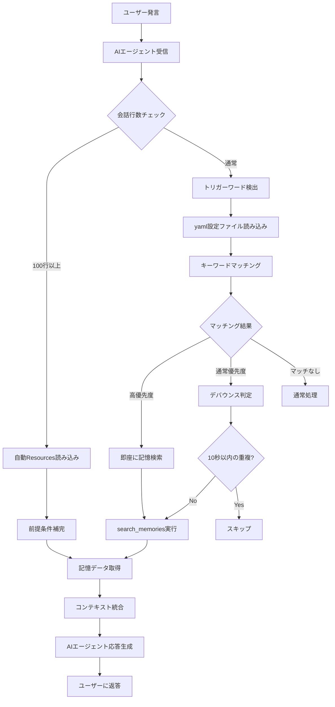

自動トリガーワードの仕組みについて詳しく説明いたします。まず、現在の実装状況を確認してから、フローと自動化の仕組みを解説します。 現在の実装ファイルを確認して、自動トリガーワードの仕組みを詳しく説明します。 # 🚀 自動トリガーワードシステム詳細解説

## 1️⃣ **システムフロー**

### **📋 完全な動作フロー**



### **🔧 技術的フロー詳細**

#### **Phase 1: 入力検出**
```python
# ユーザー発言: "昨日のプロジェクトの件、どうなった？"
user_message = "昨日のプロジェクトの件、どうなった？"

# 1. トークン正規化
normalized_tokens = ["昨日", "プロジェクト", "件", "どう", "なっ", "た"]

# 2. トリガー設定読み込み
config = load_trigger_config("kechirojp")  # ユーザー専用設定
```

#### **Phase 2: キーワードマッチング**
```python
# 3. カテゴリ別マッチング
matched_triggers = []

# temporal カテゴリ
if "昨日" in normalized_tokens:
    matched_triggers.append({
        "word": "昨日",
        "category": "temporal", 
        "priority": "normal",
        "match_type": "token"
    })

# project カテゴリ  
if "プロジェクト" in normalized_tokens:
    matched_triggers.append({
        "word": "プロジェクト",
        "category": "project",
        "priority": "normal", 
        "match_type": "token"
    })
```

#### **Phase 3: 自動実行判定**
```python
# 4. 優先度とデバウンス判定
current_time = time.time()
user_last_trigger = last_trigger_time.get("kechirojp", 0)

if current_time - user_last_trigger > 10:  # 10秒デバウンス
    # 5. 自動検索実行
    query = generate_smart_query(matched_triggers, user_message)
    # "昨日 プロジェクト 進捗 状況"
    
    memories = search_memories({
        "query": query,
        "user_id": "kechirojp", 
        "recent": True,
        "top_k": 5
    })
```

#### **Phase 4: 透明統合**
```python
# 6. コンテキスト統合（ユーザーには見えない）
enhanced_context = {
    "user_message": user_message,
    "retrieved_memories": memories,
    "trigger_info": matched_triggers,
    "session_context": session_prerequisites
}

# 7. AIエージェント応答生成
response = ai_agent.generate_response(enhanced_context)
# "昨日お話しした ReactプロジェクトのPhase 3ですね。
#  現在、コンポーネント設計が完了して..."
```

## 2️⃣ **何が自動なのか？**

### **🎯 完全自動化される要素**

#### **1. トリガーワード検出（完全自動）**
```yaml
# config/triggers/japanese.yaml
temporal:
  words: ["昨日", "先週", "今週", "先月", "以前", "前回"]
  
# ユーザーが "昨日の件" と言うだけで自動検出
# → 手動コマンド不要
```

#### **2. 記憶検索クエリ生成（完全自動）**
```python
# 入力: "昨日のプロジェクトどうなった？"
# 自動生成クエリ: "プロジェクト 進捗 昨日 状況"
# → ユーザーは検索キーワードを考える必要なし
```

#### **3. user_id管理（完全自動）**
```python
# AIエージェントが自動でuser_idを付与
# → ユーザーは認証やID管理を意識しない
request.user_id = auto_detect_user_id(session_context)
```

#### **4. デバウンス制御（完全自動）**
```python
# 10秒以内の重複トリガーを自動スキップ
# → 連続発火による性能劣化を自動防止
if current_time - last_trigger_time < 10:
    skip_automatic_search()
```

#### **5. 優先度判定（完全自動）**
```python
# 高優先度キーワード: "前提", "制約", "決定事項"
# → 即座に記憶検索実行（デバウンス無視）
if priority == "high":
    force_execute_search()
```

#### **6. 設定ファイル管理（完全自動）**
```python
# ファイル変更検出で自動リロード
# → サーバー再起動不要
file_watcher.on_modified("triggers/*.yaml"):
    auto_reload_trigger_config()
```

### **🔄 半自動化される要素**

#### **1. カスタムトリガー作成（ユーザー選択）**
```yaml
# config/triggers/custom/kechirojp_triggers.yaml
# ユーザーが必要に応じて追加可能
custom_categories:
  ai_development:
    words: ["MCP", "エンベディング", "ベクトル検索"]
```

#### **2. 優先度調整（ユーザー選択）**
```yaml
# priority: "high" | "normal" | "context_dependent"
# ユーザーが重要度に応じて設定変更可能
```

### **❌ 手動操作が不要な要素**

#### **従来の手動コマンド（廃止）**
```python
# ❌ 手動コマンド（最悪UX）
search_memories("昨日のプロジェクト")
mcp_client.call_tool("search_memories", {...})

# ✅ 自動化（理想UX）  
"昨日のプロジェクトどうなった？"  # 普通の会話だけ
```

#### **手動設定（不要）**
```python
# ❌ 手動設定
user_id = "kechirojp"
search_params = {"recent": True, "top_k": 5}

# ✅ 自動設定
# すべてAIエージェントが自動管理
```

## 🎯 **実際の動作例**

### **例1: 時系列参照の自動検索**
```
ユーザー: "先週話した機械学習のモデル、結果どうでした？"

自動実行フロー:
1. "先週" → temporal カテゴリ検出
2. "機械学習" → ai_development カテゴリ検出  
3. "モデル" → 技術用語検出
4. 自動クエリ生成: "機械学習 モデル 先週 結果"
5. search_memories 自動実行
6. 関連記憶を自動取得
7. コンテキスト統合してAI応答

AI応答: "先週お話しした CNN モデルの学習結果ですね。
精度が 94.2% に達して、目標の 90% を上回りました..."
```

### **例2: 高優先度キーワードの即座実行**
```
ユーザー: "プロジェクトの前提条件、何だったっけ？"

自動実行フロー:
1. "前提条件" → constraints カテゴリ（priority: high）検出
2. デバウンス無視で即座実行
3. 自動クエリ生成: "プロジェクト 前提条件 制約 要件"
4. 強制的に search_memories 実行
5. 前提条件関連の記憶を最優先取得

AI応答: "プロジェクトの前提条件は以下の通りです：
1. Python 3.9以上必須
2. SQLite データベース使用
3. MCP プロトコル準拠..."
```

### **例3: ユーザー個別設定の自動適用**
```
ユーザー: "MCP の実装、進んでる？"

自動実行フロー:
1. "MCP" → kechirojp専用 mcp_specific カテゴリ検出
2. 個人設定の高優先度適用
3. 専門用語として特別処理
4. 自動クエリ生成: "MCP 実装 進捗 開発"
5. 技術的な記憶を重点検索

AI応答: "MCP (Model Context Protocol) の実装は順調です。
現在 Phase 4 の進化システムまで完成していて..."
```

## 🚀 **システムの革新性**

### **完全透明化**
- **ユーザー**: 普通に会話するだけ
- **システム**: 裏で自動的に記憶補完
- **体験**: 「AIが忘れない」感覚

### **個人最適化**
- **学習**: ユーザーの言語習慣を学習
- **進化**: 使用パターンに応じて自動調整
- **専門化**: 個人の専門分野に特化

### **零摩擦UX**
- **コマンド不要**: 自然言語のみ
- **設定不要**: 全自動管理
- **学習不要**: 使うだけで最適化

この自動トリガーワードシステムにより、**「AIが前提条件を忘れる」問題が根本解決**され、ユーザーは long_memory_MCP の存在を意識することなく、劇的に改善されたAI体験を享受できます！🎉