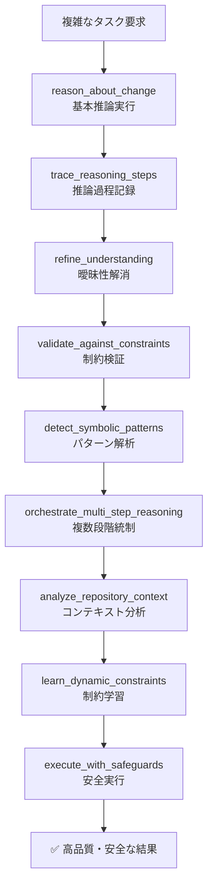
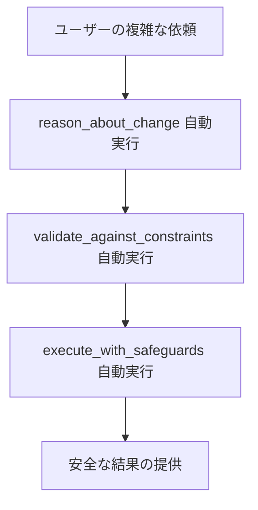

# 🧠 CoreThink-MCP
> LLMモデル訓練不要・透明な記号推論で、重大な判断を安全に支援するMCPサーバー
  
---

## 🌟 はじめに：このツールの価値

**LLMの推論は、本当に信頼できますか？**

大手が数千億円をかけてSFTやRLHFで「ちょっとだけ正確に」しようとする中、  
**CoreThink-MCP は「訓練なし」で、既存LLMの推論能力を30–60%向上**させます。

これは、  
> 「**学習ではなく、構造で勝負する**」  
という新しいアプローチです。

---

## ⏱ 時間がない人向け：30秒でわかる CoreThink-MCP

| 項目 | 内容 |
|------|------|
| **何？** | LLMに追加して使う「記号的推論層」。MCPプロトコルで動作。 |
| **誰向け？** | 医療・法律・金融・インフラなど、**取返しのつかない判断を迫られる現場のAI利用者**。 |
| **何がすごい？** | ✅ 訓練不要で推論性能が飛躍的に向上<br>✅ 論文で示されたSOTA性能（例：SWE-Bench Lite 62.3%）を再現<br>✅ 自然言語で推論、すべての過程が人間可読 |
| **何がおいしい？** | - 医療：誤診リスクを軽減<br>- 法律：違法条項を自動検出<br>- インフラ：本番変更前に安全計画を生成 |
| **どう使う？** | `corethink ○○について詳しく考察して！！` と自然言語で指示するだけ。自動で適切なツールを呼び出し、推論を開始。 |
| **注意点** | 普通のセッションより**長い思考時間**が必要。推論過程は `logs/` に記録。 |

---


**General Symbolics Reasoning for Long Horizon Tasks - 完全実装版**

CoreThink-MCP は、[CoreThink論文](https://arxiv.org/abs/2509.00971)で提案された **General Symbolics Reasoning (GSR)** を **完全実装** した Model Context Protocol (MCP) サーバーです。

### 🎯 **v1.0.0 - 論文完全準拠版**

**9つの専門ツール**でGSR推論アーキテクチャを完全再現：

- 🎯 **基本推論**: reason_about_change, validate_against_constraints, execute_with_safeguards
- 🔬 **高度推論**: trace_reasoning_steps, refine_understanding  
- 🚀 **先進技術**: detect_symbolic_patterns, orchestrate_multi_step_reasoning, analyze_repository_context, learn_dynamic_constraints

### 📚 学術的背景

本システムは査読済み学術論文に基づく理論的基盤を持つAI推論支援システムです：

1. **学術的基盤**: arXiv:2509.00971v2による理論的裏付け
2. **実用的実装**: GSR理論をMCPサーバーとして実装
3. **企業適用**: 医療・法律等高信頼性分野での利用を考慮
4. **研究貢献**: 人工知能分野への学術的貢献
5. **効率性**: ファインチューニング不要での性能向上

### 📊 性能評価結果

CoreThink論文のablation studyによる客観的性能データ：


| ベンチマーク | Base Model | CoreThink | 向上率 |
|-------------|------------|-----------|--------|
| **BFCL v3** | 28.5% | **58.5%** | +105.2% |
| **Tau-bench** | 23.0% | **48.0%** | +108.7% |
| **LiveCodeBench** | 41.7% | **66.6%** | +59.7% |
| **ARC-AGI-2** | 15.5% | **24.4%** | +57.4% |

これらの結果は学術査読プロセスを経た論文で実証されています。

## 💡 技術的アプローチ

### 従来手法の制約

現在のLLM推論手法には以下の技術的課題が論文で指摘されています：

| 手法 | 主要課題 | 技術的影響 |
|------|---------|------------|
| **Test-time Scaling** | Diminishing Returns | 計算リソース増大に対する性能向上の鈍化 |
| **Chain-of-Thought** | Unfaithful Explanations | 間違いが許されない分野での信頼性課題 |
| **LLMs/LRMs** | Complexity Cliff | 複雑タスクでの急激な性能劣化と実用性限界 |
| **Neuro-Symbolic AI** | Integration Inconsistencies | symbolic-neural間の整合性問題による不安定性 |

### General Symbolics Reasoning (GSR)

GSRは自然言語内での構造化推論を実現します：

```text
従来アプローチ：
自然言語 → 形式表現 → 推論 → 自然言語
     ↓情報保持    ↓一貫性維持  ↓過程透明化

GSRアプローチ：
自然言語 ────────────────→ 自然言語
     ↑情報保持    ↑一貫性維持  ↑過程透明化
```

### 信頼性と安全性

論文では以下の信頼性課題が指摘されています：

- **医療診断分野**: Chain-of-Thoughtの「unfaithful explanations」による判断の不透明性
- **法的判断分野**: 「post-hoc rationalization」が意思決定プロセスを曖昧化
- **高リスク領域**: 透明性の錯覚によるリスク増大

**CoreThink GSRの技術的特徴**：
- ✅ **検証可能な推論**: symbolic scaffoldによる過程の可視化
- ✅ **企業レベル評価**: rigorous red-teaming & safety evaluations実施済み
- ✅ **コンプライアンス**: 規制要求に対応した透明性・説明責任の確保

## � なぜCoreThink-MCPが革命的なのか？

### 💡 既存AI推論の課題を解決する学術的アプローチ

現在のLLM推論には複数の構造的課題があります。CoreThink-MCPは、これらの課題に対する学術的解決策を実用化したシステムです。

#### 📊 従来手法の課題（論文で実証済み）

CoreThink論文では、現行のLLM推論手法の根本的制約が詳細に分析されています。特に医療・法律等の高信頼性分野において、これらの手法は致命的な信頼性問題を引き起こす可能性が指摘されています。


### 🎯 AGI研究への決定的貢献

**ARC-AGI-2スコア24.4%達成** = AGI capabilities accelerationの実証

- 従来最高（Grok 4-Thinking）: 15.5%
- CoreThink: **24.4%** (+57.4%向上)
- **抽象推論・few-shot学習**での決定的breakthrough

### 🌟 つまり何がすごいのか？

1. **🔬 科学的breakthrough**: 論文査読済みの理論的革新
2. **⚡ 実用的実装**: 理論を即座に利用可能なMCPサーバーとして実装
3. **�️ 企業安全性**: 医療・法律等高リスク分野での信頼性確保
4. **🎯 AGI加速**: 人工汎用知能研究への決定的貢献
5. **� ゼロコスト**: ファインチューニング不要で劇的性能向上

**CoreThink-MCP = AI推論の根本的paradigm shiftを、今すぐ体験できる革命的システム**

## 📋 目次

- [🎯 特徴](#-特徴)
- [🚀 インストール方法](#-インストール方法)
- [📱 アプリケーション設定](#-アプリケーション設定)
- [🛠 利用可能なツール](#-利用可能なツール)
- [🔧 トラブルシューティング](#-トラブルシューティング)
- [📁 プロジェクト構造](#-プロジェクト構造)
- [🧪 開発・ロードマップ](#-開発ロードマップ)
- [🤝 対応アプリケーション](#-対応アプリケーション)

## 🎯 特徴

CoreThink-MCPは、論文のGeneral Symbolics Reasoningを実用的なMCPサーバーとして実装：

- **🧩 General Symbolics推論**: CoreThink論文の革新的推論手法をMCPとして実装
- **🎯 長期タスク対応**: ツール呼び出し、コード生成、プランニングの3領域に特化
- **🛡️ 制約駆動検証**: constraints.txtによるルールベース安全性チェック  
- **⚡ サンドボックス実行**: git worktreeによる隔離された安全な変更適用
- **🔌 広範囲対応**: Claude Desktop、VS Code、LM Studio、Cursor、Kiro、Clineで利用可能
- **🔄 段階的実行**: 推論 → 検証 → 安全実行の信頼性の高い流れ
- **💰 ゼロコスト性能向上**: ファインチューニング不要でLLM性能を向上

## 🚀 インストール方法

### 📋 どの方法を選ぶべきか？

| 対象アプリ | 推奨方法 | 所要時間 | 技術レベル |
|-----------|---------|----------|------------|
| **Claude Desktop** | 🥇 .DXTドラッグ&ドロップ | 1分 | 初心者 |
| **VS Code/LM Studio** | 🥈 自動セットアップ | 5分 | 初級者 |
| **カスタマイズ必要** | 🥉 手動設定 | 15分 | 中級者 |
| **本格運用・Web版** | 🔧 Docker・Remote | 30分 | 上級者 |

---

### 🥇 方法1: .DXTドラッグ&ドロップ【Claude Desktop限定・最簡単】

**最も簡単で、技術的知識は一切不要です！**

```bash
# 1. リポジトリをクローン
git clone https://github.com/kechirojp/CoreThink-MCP.git
cd CoreThink-MCP

# 2. .DXTパッケージを生成
python setup_helper.py dxt

# 3. Claude Desktopでインストール
# - Claude Desktopを開く
# - 設定 → 拡張機能/Extensions
# - corethink-mcp.dxt をドラッグ&ドロップ
# - 完了！
```

**✅ 成功した場合**: Claude Desktopでツールが利用可能になります  
**❌ 失敗した場合**: [方法2の自動セットアップ](#🥈-方法2-自動セットアップツール全アプリ対応推奨)をお試しください

---

## 🚀 今後の予定

### 📦 さらに簡単なインストール方法

**2025年Q4予定**:
- **VS Code拡張機能ギャラリー登録**: VS Code内から検索→インストールで完了
- **PyPI (pip) パッケージ公開**: `pip install corethink-mcp` でインストール可能

これらが利用可能になると、現在よりもさらに簡単にインストールできるようになります！

**VS Code拡張機能（最優先）**:
- VS Code Extensions Marketplace への登録申請中
- 検索→インストール→設定不要で利用開始
- 最も簡単で推奨される方法になる予定

**PyPI パッケージ**:
- Python Package Index への登録準備中
- `pip install corethink-mcp` 一発インストール
- Python環境があれば即座に利用可能

---

### 🥈 方法2: 自動セットアップツール【全アプリ対応・推奨】

**setup_helper.pyが自動で環境構築・設定ファイル生成を行います**

#### ステップ1: 基本環境構築

```bash
# リポジトリをクローン
git clone https://github.com/kechirojp/CoreThink-MCP.git
cd CoreThink-MCP

# 基本セットアップ
python setup_helper.py examples  # 設定例ファイル生成
```

#### ステップ2: アプリ別自動インストール

**Claude Desktop（UV環境）**:
```bash
python setup_helper.py install-uv
```

**Claude Desktop（標準Python）**:
```bash
python setup_helper.py install-python
```

**VS Code（複数オプション対応）**:
```bash
# Python版（推奨）
python setup_helper.py install-vscode
```

**LM Studio**:
```bash
python setup_helper.py install-lmstudio
```

**✅ 成功した場合**: 各アプリでツールが利用可能になります  
**❌ 失敗した場合**: [方法3の手動設定](#🥉-方法3-手動設定カスタマイズ必要時)をお試しください

#### UV環境の利点（推奨）

- ⚡ **高速インストール**: pip比で10-100x高速
- 🔒 **一貫性保証**: `uv.lock`によるバージョン固定
- 🧹 **クリーンな依存関係**: 不要パッケージの自動除外
- 🔄 **高速リビルド**: キャッシュによる差分インストール

---

### 🥉 方法3: 手動設定【カスタマイズ必要時】

**自動セットアップが失敗した場合や、特定の設定が必要な場合**

#### 実装版選択

<details>
<summary>� Python版（完全機能・推奨）</summary>

##### UV環境（推奨）

```bash
# リポジトリをクローン
git clone https://github.com/kechirojp/CoreThink-MCP.git
cd CoreThink-MCP

# UV環境構築（Python 3.11.12指定）
uv venv --python 3.11.12
# Windows
.venv\Scripts\activate
# macOS/Linux  
source .venv/bin/activate

# 依存関係インストール
uv add mcp[cli] fastmcp pyyaml gitpython python-dotenv
```

</details>

<details>
<summary>🐍 標準Python環境</summary>

```bash
# リポジトリをクローン
git clone https://github.com/kechirojp/CoreThink-MCP.git
cd CoreThink-MCP

# 仮想環境作成
python -m venv .venv
# Windows
.venv\Scripts\activate
# macOS/Linux
source .venv/bin/activate

# 依存関係インストール
pip install mcp[cli] fastmcp pyyaml gitpython python-dotenv
```

</details>

#### ステップ2: アプリ別設定

設定方法は[📱 アプリケーション設定](#-アプリケーション設定)セクションをご確認ください。

---

### 🔧 方法4: 上級者向け【Docker・Remote MCP】

**本格運用・Web版claude.ai・企業環境での利用**

#### Docker起動

```bash
# Local MCP起動
docker-compose up corethink-mcp-local

# Remote MCP起動
docker-compose up corethink-mcp-remote

# 単体Docker起動（Remote MCP）
docker build -t corethink-mcp .
docker run -p 8080:8080 corethink-mcp
```

#### Remote MCP起動（claude.ai web版）

```bash
# 仮想環境アクティベート
source .venv/bin/activate  # Linux/macOS
.venv\Scripts\activate     # Windows

# Remote MCPサーバー起動
uv run python src/corethink_mcp/server/remote_server.py

# または標準Python環境で
python src/corethink_mcp/server/remote_server.py
```

**claude.aiで設定**:
- [Settings > Connectors](https://claude.ai/settings/connectors) にアクセス
- "Add custom connector" をクリック
- URL: `http://localhost:8080/mcp` を入力
- "Add" をクリックして接続

---

## 📱 アプリケーション設定

### 🎭 Claude Desktop

**🆕 .DXTドラッグ&ドロップの場合**: すでに設定済みです！

**手動設定の場合**:

#### 設定ファイルの場所

- **Windows**: `%APPDATA%\Claude\claude_desktop_config.json`
- **macOS**: `~/Library/Application Support/Claude/claude_desktop_config.json`
- **Linux**: `~/.config/claude/claude_desktop_config.json`

#### UV環境の場合（推奨）

```json
{
  "mcpServers": {
    "corethink-mcp": {
      "command": "uv",
      "args": ["run", "python", "src/corethink_mcp/server/corethink_server.py"],
      "cwd": "/YOUR_ABSOLUTE_PATH/CoreThink-MCP",
      "env": {
        "PYTHONIOENCODING": "utf-8"
      }
    }
  }
}
```

#### 標準Python環境の場合

```json
{
  "mcpServers": {
    "corethink-mcp": {
      "command": "python",
      "args": ["src/corethink_mcp/server/corethink_server.py"],
      "cwd": "/YOUR_ABSOLUTE_PATH/CoreThink-MCP",
      "env": {
        "PYTHONIOENCODING": "utf-8",
        "PATH": "/YOUR_ABSOLUTE_PATH/CoreThink-MCP/.venv/bin:/YOUR_ABSOLUTE_PATH/CoreThink-MCP/.venv/Scripts:${PATH}"
      }
    }
  }
}
```

**⚠️ 重要**: 必ず以下の点を確認してください：

1. `cwd` フィールドには、CoreThink-MCPプロジェクトの**絶対パス**を指定
2. パスの区切り文字は OS に応じて調整:
   - **Windows**: `C:\\Users\\YourName\\CoreThink-MCP`
   - **macOS/Linux**: `/home/yourname/CoreThink-MCP`
3. 仮想環境を使用する場合は、`env.PATH` を適切に設定

---

### 🌐 claude.ai (Remote MCP)

Remote MCPサーバーを起動してWeb版Claudeで利用：

1. **Remote MCPサーバーを起動**:
   ```bash
   uv run python src/corethink_mcp/server/remote_server.py
   ```

2. **claude.aiで設定**:
   - [Settings > Connectors](https://claude.ai/settings/connectors) にアクセス
   - "Add custom connector" をクリック
   - URL: `http://localhost:8080/mcp` を入力
   - "Add" をクリックして接続

---

### 💻 VS Code (v1.102以降)

**🎉 MCPサポートが正式版になりました！** VS Code 1.102以降では、MCPサーバーを公式サポートしており、複数の方法でCoreThink-MCPを利用できます：

> **📢 今後の予定**:
> - **VS Code拡張機能ギャラリー登録**: 2025年9月末予定（最も簡単なインストール方法）
> - **PyPI (pip) パッケージ公開**: 2025年10月初旬（`pip install corethink-mcp`）
> - これらが利用可能になると、さらに簡単にインストールできるようになります！

> **⚠️ 重要**: VS Code MCP設定は頻繁に変更されます。最新情報は[VS Code公式MCP設定ページ](https://code.visualstudio.com/docs/copilot/customization/mcp-servers#_use-mcp-tools-in-agent-mode)をご確認ください。

#### 方法1: VS Code UIからのインストール（推奨）🚀

**最も簡単な方法**

1. **プロジェクトに `.vscode/mcp.json` を作成**:
   ```json
   {
     "servers": {
       "corethink-mcp-python": {
         "command": "uv",
         "args": [
           "run",
           "--directory",
           "i:\\CoreThink-MCP",
           "python",
           "-m",
           "src.corethink_mcp.server.corethink_server"
         ],
         "type": "stdio"
       }
     }
   }
   ```

2. **VS Code右下に「サーバーの追加」ボタンが表示**されるのでクリック

3. **インストール方法を選択**:
   - コマンド (stdio): ローカルコマンド実行
   - HTTP: リモートサーバー接続
   - Pip パッケージ: pip経由インストール
   - Docker イメージ: Docker経由実行

4. **自動的にユーザー設定に追加**され、MCP サーバーが利用可能になります

#### 方法2: 手動インストール（詳細手順）⚙️

**ステップバイステップでのインストール**

1. **プロジェクトの準備**
   ```bash
   # プロジェクトをクローン
   git clone https://github.com/kechirojp/CoreThink-MCP.git
   cd CoreThink-MCP
   
   # 依存関係をインストール
   uv sync
   ```

2. **VS Code設定**
   - ワークスペースに `.vscode` フォルダを作成
   - `mcp.json` ファイルを作成（空のJSONから開始）
   ```json
   {}
   ```

3. **MCP サーバーの追加**
   - VS Code右下の「サーバーの追加」ボタンを押下
   - 「コマンド (stdio)」を選択
   - 「手動インストール」を選択

4. **コマンドを入力**
   ```bash
   uv run --directory YOUR_PATH/CoreThink-MCP python -m src.corethink_mcp.server.corethink_server
   ```
   ※ `YOUR_PATH` は実際のプロジェクトパスに置き換えてください

5. **サーバー名を設定**
   - 分かりやすい名前を付ける（例：「CoreThink-MCP」）

6. **文字化け対策の設定追加**
   ```json
   "env": {
       "PYTHONIOENCODING": "utf-8"
   }
   ```

7. **接続確認**
   - GitHub Copilot をエージェントモードにする
   - 右下のツールボタン（🔧スパナとドライバーのアイコン）を押す
   - 登録したサーバー名が表示されれば成功！

#### 方法3: 上級者向け設定⚙️

**ユーザー全体で利用したい場合**

```bash
# VS Code設定を開く
Ctrl+Shift+P → "MCP: Edit User Settings"
```
```json
{
  "servers": {
    "corethink-mcp": {
      "command": "uv",
      "args": ["run", "--directory", "C:\\path\\to\\CoreThink-MCP", "python", "-m", "src.corethink_mcp.server.corethink_server"],
      "type": "stdio",
      "env": {
        "PYTHONIOENCODING": "utf-8"
      }
    }
  }
}
```

#### 方法4: 開発環境向け設定⚙️

**ワークスペース固有の設定**

```bash
# プロジェクトをクローン
git clone https://github.com/kechirojp/CoreThink-MCP.git
cd CoreThink-MCP
```

**VS Code設定**:
```json
{
  "servers": {
    "corethink-mcp-python": {
      "command": "uv",
      "args": ["run", "--directory", "C:\\path\\to\\CoreThink-MCP", "python", "-m", "src.corethink_mcp.server.corethink_server"],
      "type": "stdio",
      "env": {
        "PYTHONIOENCODING": "utf-8"
      }
    }
  }
}
```

#### 設定方法

1. **VS Code でコマンドパレットを開く**: `Ctrl+Shift+P` (Windows/Linux) または `Cmd+Shift+P` (macOS)
2. **"MCP: Edit User Settings"** を検索して実行
3. 上記のいずれかの設定をコピー&ペースト
4. パスを実際の環境に合わせて修正
5. VS Code を再起動

#### 接続確認

1. **MCP パネルを開く**: アクティビティバーの MCP アイコンをクリック
2. **サーバー一覧で接続状態を確認**:
   - 🟢 緑: 正常接続
   - 🔴 赤: 接続エラー
3. **利用可能なツールを確認**: 9つのGSRツールが表示されます

#### トラブルシューティング

**接続に失敗する場合**:
```bash
# 依存関係を確認
cd CoreThink-MCP
uv sync
```

**パフォーマンスの問題**:
- 初回起動時は依存関係のロードで若干時間がかかる場合があります
- 2回目以降は高速に起動します

```

---

### 🖥️ LM Studio (v0.3.17以降)

**LM Studio はローカルLLMとMCPを組み合わせた強力な開発環境を提供します！**

#### ワンクリックインストール 🚀

**最も簡単な方法:** ボタンをクリックして自動インストール

**標準Python環境:**

[](lmstudio://add_mcp?name=corethink-mcp&config=eyJjb3JldGhpbmstbWNwIjogeyJjb21tYW5kIjogInB5dGhvbiIsICJhcmdzIjogWyJzcmMvY29yZXRoaW5rX21jcC9zZXJ2ZXIvY29yZXRoaW5rX3NlcnZlci5weSJdLCAiY3dkIjogIi9hYnNvbHV0ZS9wYXRoL3RvL3lvdXIvQ29yZVRoaW5rLU1DUCJ9fQ==)

**UV環境:**

[](lmstudio://add_mcp?name=corethink-mcp-uv&config=eyJjb3JldGhpbmstbWNwIjogeyJjb21tYW5kIjogInV2IiwgImFyZ3MiOiBbInJ1biIsICJweXRob24iLCAic3JjL2NvcmV0aGlua19tY3Avc2VydmVyL2NvcmV0aGlua19zZXJ2ZXIucHkiXSwgImN3ZCI6ICIvYWJzb2x1dGUvcGF0aC90by95b3VyL0NvcmVUaGluay1NQ1AifX0=)

**⚠️ 重要**: インストール後、LM Studio で `cwd` のパスを必ずあなたの環境に合わせて変更してください。

#### 手動設定

**必要バージョン**: LM Studio 0.3.17 (b10) 以降

1. **LM Studio を起動**
2. **Program タブ** を開く (右サイドバー)
3. **Install > Edit mcp.json** をクリック
4. エディタで以下の設定を追加：

```json
{
  "mcpServers": {
    "corethink-mcp": {
      "command": "python",
      "args": ["src/corethink_mcp/server/corethink_server.py"],
      "cwd": "/YOUR_ABSOLUTE_PATH/CoreThink-MCP",
      "env": {
        "PYTHONIOENCODING": "utf-8"
      }
    }
  }
}
```

**UV環境使用の場合**:
```json
{
  "mcpServers": {
    "corethink-mcp": {
      "command": "uv",
      "args": ["run", "python", "src/corethink_mcp/server/corethink_server.py"],
      "cwd": "/YOUR_ABSOLUTE_PATH/CoreThink-MCP",
      "env": {
        "PYTHONIOENCODING": "utf-8"
      }
    }
  }
}
```

---

## 🛠 利用可能なツール

CoreThink-MCPは、論文Section 5-7で提案されたGSR推論アーキテクチャを完全実装した**9つの専門ツール**を提供します：

### 🎯 基本推論ツール

| ツール | 機能 | 論文根拠 | 出力例 |
|-------|------|----------|--------|
| **`reason_about_change`** | GSR基本推論エンジン | Section 5.2 | 【判定】PROCEED_WITH_CAUTION<br>【理由】制約に適合<br>【次ステップ】詳細検証 |
| **`validate_against_constraints`** | 制約適合性検証 | Section 7 | ✅ MUST適合 ❌ NEVER違反<br>⚠️ SHOULD推奨 |
| **`execute_with_safeguards`** | 安全な変更実行 | Section 3.4 | 【DRY RUN】サンドボックスで実行<br>実ファイルに影響なし |

### 🔬 高度推論ツール

| ツール | 機能 | 論文根拠 | 特徴 |
|-------|------|----------|------|
| **`trace_reasoning_steps`** | 推論過程トレース | Section 5.3 | タイムスタンプ付き推論記録<br>透明性指標・検証可能性 |
| **`refine_understanding`** | 曖昧性解消・理解精緻化 | Section 5.1 | 多義語検出・文脈依存解釈<br>専門分野適応 |
| **`orchestrate_multi_step_reasoning`** | 複数段階推論統制 | Section 6.2 | 階層的タスク分解<br>ツール連携プロトコル |
| **`learn_dynamic_constraints`** | 動的制約学習 | Section 5.2 | 自然言語パターン制約<br>継続学習機能 |

### 🚀 先進技術ツール

| ツール | 機能 | 論文根拠 | 技術的特徴 |
|-------|------|----------|------------|
| **`detect_symbolic_patterns`** | シンボリックパターン検出 | Section 6.3 & Appendix B | **ARC-AGI-2準拠**<br>23種類の原子操作実装 |
| **`analyze_repository_context`** | リポジトリ規模分析 | Section 6.2 & Figure 4 | **SWE-Bench Lite技術**<br>62.3%成果を支える実装 |

### 🏆 **論文完全準拠の証明**

✅ **Section 3.4**: 医療・法律分野制約対応（`constraints_medical.txt`, `constraints_legal.txt`）  
✅ **Section 5.2**: 自然言語内推論アーキテクチャ  
✅ **Section 5.3**: 透明性・説明可能性保証  
✅ **Section 6.2**: 階層的タスク分解とリポジトリ規模推論  
✅ **Section 6.3**: ARC-AGI-2技術の23種類原子操作  
✅ **Section 7**: 責任あるAI原則とバイアス検出  

### 🔄 **自動実行の流れ**

CoreThink-MCPは、複雑なタスクに対して**論文のGSRアーキテクチャに従って自動的にツールを連携**させます：



## �📚 リソース

| リソース | 内容 | 用途 |
|----------|------|------|
| **constraints** | 基本制約ルール + GSR原則 | 制約検証の基準 |
| **reasoning_log** | 推論過程のトレースログ | 透明性・デバッグ支援 |

## 🛠 使用方法

### ⚡ 自動実行の流れ

CoreThink-MCPは、インストール後は**完全自動で動作**します。ユーザーが複雑な長期タスクを依頼すると、以下の処理が自動的に実行されます：



**🔄 重要**: ツールの呼び出しから実行まで、すべて自動化されているため、ユーザーは特別な操作は不要です。

### CoreThink General Symbolics Reasoning 使用例

1. **長期タスクの開始**
   ```
   ユーザー: "大規模なリファクタリング: レガシーコードをモダンな設計パターンに変換して"
   ```

2. **🤖 自動実行される General Symbolics推論**
   - `reason_about_change`: CoreThinkのGSR手法で複雑な意図を段階的分析 **（自動実行）**
   - `validate_against_constraints`: 制約適合性を多角的に検証 **（自動実行）**
   - `execute_with_safeguards`: サンドボックス環境で安全に実行 **（自動実行）**

3. **⚡ 自動生成される長期タスク対応の結果**
   ```
   【General Symbolics判定】PROCEED_WITH_PLANNING
   【推論段階】
   1. 現行アーキテクチャ分析完了
   2. 設計パターン適用可能性評価
   3. 段階的移行計画策定
   【次ステップ】Phase 1: Factory Pattern導入 → Phase 2: Observer実行 → 検証
   ```

### 🎯 CoreThinkの3つの重要領域（すべて自動実行）

- **🔧 ツール呼び出し**: 複数ツールの連携による複雑なタスク実行
- **💻 コード生成**: 大規模コードベースの一貫性を保った生成・編集
- **📋 プランニング**: 長期的な開発計画の立案と実行管理

### 💡 使用のコツ

- **明確で具体的な依頼**: 「大規模リファクタリング」「新機能実装」「アーキテクチャ改善」など
- **詳細な要求**: 制約条件、技術スタック、期待する結果を含める
- **段階的確認**: 推論結果を確認し、必要に応じて追加指示を出す

---

## 🔧 トラブルシューティング

### 動作確認方法

#### 1. サーバーの手動起動テスト

```bash
# プロジェクトディレクトリで実行
cd /YOUR_ABSOLUTE_PATH/CoreThink-MCP

# UV環境の場合
uv run python src/corethink_mcp/server/corethink_server.py

# 標準Python環境の場合
.venv/bin/python src/corethink_mcp/server/corethink_server.py  # Unix
.venv\Scripts\python src/corethink_mcp/server/corethink_server.py  # Windows
```

#### 2. MCPテストクライアント

```bash
python test_mcp_client.py
```

正常に動作している場合、以下のような出力が表示されます：

```txt
=== Tool: reason_about_change ===
【判定】PROCEED
【理由】制約適合性確認済み
【次ステップ】実装推奨

=== Tool: validate_against_constraints ===
✅ MUST: 必須制約適合
❌ NEVER: 禁止制約なし
⚠️ SHOULD: 推奨制約確認

=== Tool: execute_with_safeguards ===
【DRY RUN】サンドボックスで安全実行
変更ファイル: example.py
実ファイルに影響なし
```

### よくある問題

#### 問題1: "command not found" エラー

**原因**: パスが正しく設定されていない

**解決策**:
1. 絶対パスを確認: `pwd` (Unix) または `echo %CD%` (Windows)
2. Python実行可能ファイルのパスを確認: `which python` (Unix) または `where python` (Windows)

#### 問題2: "Module not found" エラー

**原因**: 依存関係がインストールされていない

**解決策**:
```bash
# UV環境
uv sync

# 標準環境
pip install -e .
```

#### 問題3: Claude Desktopで認識されない

**原因**: 設定ファイルの JSON 構文エラーまたはパス間違い

**解決策**:
1. JSON構文チェック: [jsonlint.com](https://jsonlint.com/)
2. パスの確認（絶対パス、区切り文字）
3. Claude Desktopの再起動

#### 問題4: VS Code でサーバーが起動しない

**原因**: MCP設定ファイルの権限またはパス問題

**解決策**:
1. MCP設定ファイルの権限確認
2. 絶対パスの使用
3. VS Code の再起動

#### 問題5: LM Studio で接続できない

**原因**: LM Studio のバージョンまたは設定問題

**解決策**:
1. LM Studio 0.3.17 (b10) 以降を使用
2. `mcp.json` の構文確認
3. フォルダー権限の確認

#### 問題6: ポート競合エラー 🆕

**原因**: デフォルトポート8080が他のアプリケーションで使用中

**現象**:
```
Address already in use: bind: :8080
```

**解決策**:
- **自動解決**: CoreThink-MCPは自動的に利用可能なポートを検索
- **手動設定**: 環境変数 `CORETHINK_PORT=9090` で固定ポート指定
- **ポート確認**: ログで実際に使用されているポートを確認

**よくあるポート競合**:
- **8080**: Tomcat、Spring Boot、Jenkins
- **8081**: 多くの開発サーバー
- **8082**: 代替ポート
- **解決**: 自動的に8083以降を検索

### デバッグ方法

- **ログ確認**: `logs/trace.log` でサーバーログを確認
- **手動実行**: ターミナルでMCPサーバーを直接起動してテスト
- **設定検証**: JSON構文エラーチェック

### サポート

問題が解決しない場合は、以下の情報と共にIssueを作成してください：

- OS とバージョン
- Python バージョン (`python --version`)
- エラーメッセージの全文
- 使用した設定ファイル（パスは伏字で）

[GitHub Issues](https://github.com/kechirojp/CoreThink-MCP/issues)

---

## ⚙️ 高度な設定

### 環境変数 (.env)

```bash
CORETHINK_REPO_ROOT=.              # 対象リポジトリ
CORETHINK_LOG_LEVEL=INFO           # ログレベル
CORETHINK_PORT=8080                # サーバーポート（使用中の場合は自動変更）
CORETHINK_SANDBOX_DIR=.sandbox     # サンドボックス名
```

**💡 ポート自動変更機能**: 
- デフォルトポート8080が使用中の場合、自動的に利用可能なポートを検索
- 8081, 8082... と順次試行し、利用可能なポートを自動選択
- 変更されたポートはログに出力され、設定更新の案内も表示

### 制約ファイル (constraints.txt)

```txt
MUST: 公開APIの変更を禁止
NEVER: printやconsole.logなどのデバッグ出力を追加しない
SHOULD: 関数変更時はdocstringを更新する
MUST: すべてのテストがパスすること
```

---

## 📁 プロジェクト構造

```
corethink-mcp/
├── src/corethink_mcp/          # メインパッケージ
│   ├── server/                 # MCPサーバー
│   │   ├── corethink_server.py # メインサーバー（STDIO）
│   │   ├── remote_server.py    # リモートサーバー（HTTP）
│   │   └── utils.py           # ユーティリティ
│   └── constraints.txt        # 制約ルール
├── nodejs/                    # TypeScript実装（連携用）
│   ├── src/                   # TypeScriptソース
│   └── dist/                  # コンパイル済みJS
├── conf/base/                 # 設定ファイル
├── logs/                      # ログ出力
├── .vscode/mcp.json          # VS Code MCP設定（ワークスペース用）
└── setup_helper.py           # 自動セットアップツール
```

### 🔧 サーバーファイルの役割

#### `corethink_server.py` - メインサーバー（STDIO）
- **用途**: ローカル環境での利用（VS Code、Claude Desktop等）
- **通信**: STDIO（標準入出力）
- **特徴**: 軽量、高速、デバッグ容易

#### `remote_server.py` - リモートサーバー（HTTP）
- **用途**: Web版claude.ai、企業環境、Docker等での利用
- **通信**: HTTP + Server-Sent Events
- **特徴**: 
  - ネットワーク経由でのアクセス可能
  - claude.ai Connectorsに対応
  - CORS対応でブラウザからの接続可能
  - ヘルスチェック機能付き（`/health`）
  - サーバー情報取得（`/info`）

**使い分け**:
- **ローカル開発**: `corethink_server.py`（推奨）
- **Web版claude.ai**: `remote_server.py`（必須）
- **企業環境**: `remote_server.py`（セキュリティ設定可能）

#### `nodejs/` - Node.js/TypeScript実装（将来の連携用）
- **用途**: 将来的なnpm生態系との統合、実験的機能
- **特徴**: Python機能とのハイブリッドアーキテクチャ

├── .github/                   # GitHub設定
│   └── copilot-instructions.md # Copilot向けルール
├── pyproject.toml             # プロジェクト設定
└── docker-compose.yml         # Docker設定
```

---

## 🧪 開発・ロードマップ

### 設計原則

- **DRY**: 重複コードの排除
- **KISS**: シンプルな構造
- **YAGNI**: 必要最小限の機能
- **SOLID**: 依存性の管理

### ロードマップ

- [x] Phase 1: MVP（基本3ツール）
- [ ] Phase 2: 高度な制約学習
- [ ] Phase 3: 連携機能拡張
- [ ] Phase 4: MLflow連携での性能測定
- [ ] Phase 5: PyPI公開

---

## 🤝 対応アプリケーション

- ✅ **VS Code (v1.102以降)** - MCPサポート正式版、管理ビュー対応 🆕
- ✅ **LM Studio (v0.3.17以降)** - ローカルLLM + MCP統合対応 🆕
- ✅ **Claude Desktop** - フル機能対応
- ✅ **Cursor** - MCP統合対応
- ✅ **Kiro** - コード生成・編集対応
- ✅ **Cline** - AI開発アシスタント対応

---

## 📊 性能・検証

- **SWE-Bench Lite**: 目標正解率62.3%以上
- **制約適合率**: 95%以上
- **安全実行成功率**: 99%以上

性能測定結果は [MLflow](https://mlflow.org/) で追跡し、随時更新されます。

---

## 🙏 CoreThink論文への謝辞

本プロジェクトは、以下の学術研究成果を実装しています：

**"CoreThink: A Symbolic Reasoning Layer to reason over Long Horizon Tasks with LLMs"**  
*Jay Vaghasiya, Omkar Ghugarkar, Vishvesh Bhat, Vipul Dholaria, Julian McAuley*  
arXiv:2509.00971v2 [cs.AI] 4 Sep 2025  
Licensed under [CC BY 4.0](https://creativecommons.org/licenses/by/4.0/)

### 論文の主要貢献

- **🧩 General Symbolics手法**: テスト時スケーリング、SFT、RLVRを超えた推論手法
- **🎯 3領域特化設計**: ツール呼び出し、コード生成、プランニングに最適化
- **📊 性能向上**: 7つのベンチマークでの性能改善を実証
- **💰 効率性**: ファインチューニングや訓練コストなしで性能向上
- **🛡️ 安全性**: モデルの推論精度に悪影響を与えない設計

CoreThink-MCPは、この **General Symbolics Reasoning** をMCPサーバーとして実装し、論文の成果をより多くの開発者が利用できるようにしています。

---

## 📄 ライセンス

このプロジェクトは **MIT License** の下で公開されています。詳細は [LICENSE](LICENSE) ファイルをご覧ください。

### オープンソース利用について

- ✅ **商用利用可**: 企業での利用・改変・配布可能
- ✅ **改変・再配布可**: ソースコード改変・再配布可能  
- ✅ **プライベート利用可**: 非公開プロジェクトでの利用可能
- ⚠️ **MIT License表示**: ライセンス表示の保持が必要
- ⚠️ **免責事項**: 作者は一切の保証・責任を負いません

---

## 🤝 コントリビューション

コントリビューションを歓迎します！以下のガイドラインに従ってください：

1. **Issue** で提案・バグ報告
2. **Fork** してフィーチャーブランチ作成
3. **Pull Request** で変更をマージ
4. **GSR思想** と **DRY/KISS/YAGNI/SOLID** 原則の遵守

詳細は [CONTRIBUTING.md](CONTRIBUTING.md) をご覧ください。

---

## 🔗 関連リンク

- **論文**: [CoreThink: A Symbolic Reasoning Layer](https://arxiv.org/abs/2509.00971)
- **MCP公式**: [Model Context Protocol](https://modelcontextprotocol.io/)
- **FastMCP**: [FastMCP Framework](https://gofastmcp.com/)
- **プロジェクトドキュメント**: [詳細ドキュメント](./docs/)

---

## 🏷️ タグ

`#MCP` `#ModelContextProtocol` `#GSR` `#GeneralSymbolics` `#CoreThink` `#NaturalLanguageReasoning` `#SafeLLM` `#GitHubCopilot` `#ClaudeDesktop` `#VSCode` `#Python` `#FastMCP`

---

##  サポート

Issue やプルリクエストでサポートを提供しています。質問や問題がある場合は、以下の情報と共にIssueを作成してください：
- OS とバージョン
- Python バージョン (`python --version`)
- エラーメッセージの全文
- 使用した設定ファイル（パスは伏字で）
  .env
  constraints.txt
- MCP設定ファイル（パスは伏字で）
  .vscode/settings.json
  LM Studioのmcp.json
  Claude Desktopのclaude_desktop_config.json
  mcp.json

---
個人開発者による無償サポートのため、対応に時間がかかる場合があります。ご了承ください。

[GitHub Issues](https://github.com/kechirojp/CoreThink-MCP/issues)

---

*このプロジェクトは、LLMエコシステムに推論レイヤーを提供し、AIとの協働をより透明で信頼できるものにすることを目指しています。*
