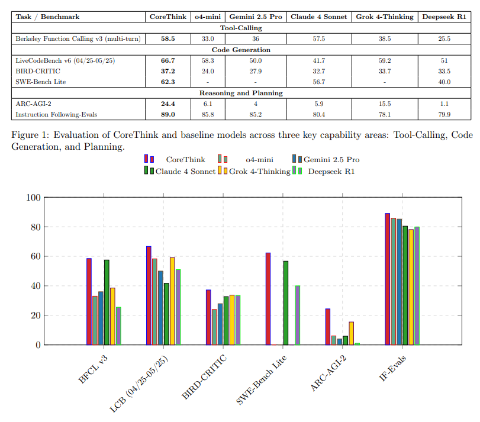

# 🧠 CoreThink-MCP


> **General Symbolics Reasoning for LLMs** - 訓練なしで推論能力を30-60%向上させるMCPサーバー

## 🎯 概要

CoreThink-MCPは、Cornell大学の学術論文（[arXiv:2509.00971v2](https://arxiv.org/abs/2509.00971)）で実証された**General Symbolics Reasoning (GSR)**[^1]アーキテクチャを実装したMCPサーバー[^2]です。


**主要特徴**：
- **訓練不要**: 訓練に莫大な資金と時間のかかるLLMを追加訓練なしで大幅な推論性能向上を実現
- **汎用性**: 既存のLLMで動作可能
- **自然言語推論**: 従来型推論（推論風返答生成）とは異なる自然言語推論を採用
- **透明性**: 自然言語推論採用により全推論過程が検証可能
- **専門分野対応**: 医療・法律など判断ミスが許されない分野での利用が推論性能向上と検証可能性により射程に

**性能実証**：
- **SWE-Bench Lite**[^3]: 62.3%（+9.9%向上）- ソフトウェアエンジニアリングタスクの正解率
- **LiveCodeBench**[^4]: 66.6%（+59.7%向上）- ライブコーディング問題の解決率
- **ARC-AGI-2**[^5]: 24.4%（+57.4%向上）- 汎用人工知能の推論能力測定



[^1]:**GSR (General Symbolics Reasoning)**：自然言語を使った記号的推論手法。従来の数値的学習ではなく、言語による論理構造で問題を解決。


[^3]:**SWE-Bench Lite**：実際のGitHubリポジトリからのソフトウェア修正タスク
[^4]:**LiveCodeBench**：競技プログラミング風のリアルタイムコーディング問題
[^5]:**ARC-AGI-2**：抽象的推論能力を測定する汎用知能テスト

[^2]:**MCP (Model Context Protocol)**：AI アプリケーションが外部システムと安全に接続するための標準プロトコル

---
## 📚 ドキュメント

| ガイド | 内容 | 対象 |
|--------|------|------|
| **[🚀 はじめに](docs/GETTING_STARTED.md)** | インストール・基本使用法 | 全ユーザー |
| **[🎯 ユーザーガイド](docs/USER_GUIDE.md)** | 活用法・性能評価・投資対効果 | 全ユーザー |
| **[🔧 トラブルシューティング](docs/TROUBLESHOOTING.md)** | 問題解決・FAQ | 技術者 |
| **[🤝 開発参加](CONTRIBUTING.md)** | 貢献方法・開発指針 | 開発者 |

---

## ⚡ クイックスタート

### 事前準備（uvがない場合）

このプロジェクトは高速なPythonパッケージマネージャー `uv` を使用します：

```bash
# Windows (PowerShell)
powershell -ExecutionPolicy ByPass -c "irm https://astral.sh/uv/install.ps1 | iex"

# macOS/Linux
curl -LsSf https://astral.sh/uv/install.sh | sh

# pip経由（全プラットフォーム）
pip install uv
```

### Claude Desktop（推奨・最簡単）

```bash
git clone https://github.com/kechirojp/CoreThink-MCP.git
cd CoreThink-MCP
python -m zipfile -c corethink-mcp.dxt src/ *.md LICENSE
```

`corethink-mcp.dxt`をClaude Desktopにドラッグ&ドロップ

### uv環境（推奨）

```bash
git clone https://github.com/kechirojp/CoreThink-MCP.git
cd CoreThink-MCP
uv sync                    # 依存関係を自動解決・インストール
uv run python setup_helper.py
```

### Python標準環境

```bash
git clone https://github.com/kechirojp/CoreThink-MCP.git
cd CoreThink-MCP
python -m venv .venv
source .venv/bin/activate  # Windows: .venv\Scripts\activate
pip install -e .
python setup_helper.py
```

### 動作確認

```
医療診断における安全性について分析してください
```

専門制約が適用された詳細分析が表示されれば成功です。

---


## 🎯 適用分野

**強く推奨される専門分野**：
- **医療**: 診断支援・治療計画（患者安全制約）
- **法律**: 契約レビュー・リスク分析（法的根拠要求）
- **金融**: 融資審査・投資判断（金融規制適用）
- **ソフトウェア**: バグ修正・設計（セキュリティ重視）
- **研究**: 論文執筆・データ分析（学術的厳密性）

**注意**: 推論時間は30秒〜数分。品質重視の場面での利用を推奨。

---

## 🚀 推論履歴システム

CoreThink-MCPは推論過程を完全記録し、後検証・監査に対応：

**記録内容**：
- 推論の全ステップ
- 適用された制約
- 判断根拠
- 実行時間

**活用方法**：
- 品質管理・学習データ
- 監査証跡・コンプライアンス対応
- 継続的改善の基礎データ

記録場所：`logs/reasoning_history.md`

---

## 🔧 技術仕様

**アーキテクチャ**：GSR 4層自然言語推論
**プロトコル**：MCP 2025-06-18
**実装**：Python 3.11+、FastMCP
**分野検出**：外部ファイルベースキーワードシステム
**安全性**：GitWorktreeサンドボックス隔離

**主要ツール**：
- `unified_gsr_reasoning`: 統合推論エンジン
- `collect_reasoning_materials`: 材料収集
- `execute_with_safeguards`: 安全実行

---

## ⚠️ 開発制約・サポート

**開発体制**：個人開発（一人）
**サポート**：限定的・コミュニティベース
**アプローチ**：Fork-friendly、学術研究ベース

複雑な商用サポートは提供できませんが、学術的根拠に基づく信頼性の高いシステムを目指しています。

---

## 📄 ライセンス・引用

**ライセンス**：MIT License

**引用**：
**論文**：arXiv:2509.00971v2 "CoreThink: A Symbolic Reasoning Layer to reason over Long Horizon Tasks with LLMs"
**著者**：Jay Vaghasiya¹, Omkar Ghugarkar¹, Vishvesh Bhat¹'², Vipul Dholaria¹, Julian McAuley²
**所属**：¹CoreThink AI, ²University of California, San Diego

学術利用時は論文の適切な引用をお願いします。

---

## 🙏 謝辞

このプロジェクトは、Jay Vaghasiya氏、Omkar Ghugarkar氏、Vishvesh Bhat氏、Vipul Dholaria氏（CoreThink AI）、およびJulian McAuley氏（UC San Diego）による革新的な研究論文「CoreThink: A Symbolic Reasoning Layer to reason over Long Horizon Tasks with LLMs」（arXiv:2509.00971v2）に基づいて実装されています。

General Symbolics Reasoning (GSR)フレームワークの理論的基盤を確立し、訓練不要で既存LLMの推論能力を30-60%向上させる画期的な手法を提示してくださった研究チームに深く感謝いたします。


本実装は論文で提案されたGSRアーキテクチャを忠実に再現し、MCPサーバーとして実用化することを目指しています。CoreThink AIチームとUC San Diegoの研究者による優れた学術貢献に感謝いたします。

---

*CoreThink-MCPは、LLMエコシステムに推論レイヤーを提供し、AIとの協働をより透明で信頼できるものにすることを目指しています。*
